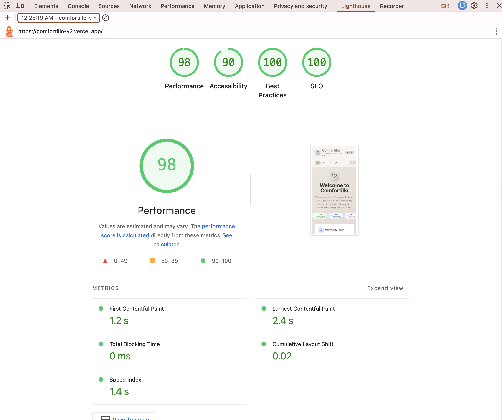

## 🚀 Evolution: From v1 to v2

This project represents my journey in software engineering.

### 📂 v1-legacy (3 Months Ago)
* **Tech Stack:** HTML, CSS, Vanilla JavaScript.
* **Status:** Initial prototype. Focused on basic functionality.
* **Learning Outcome:** Understanding the core logic of DOM manipulation and user input handling.

### ⚡ v2-current (Production)
* **Tech Stack:** React, Next.js, Tailwind CSS, TypeScript.
* **Status:** Live MVP (Deployed on Vercel).
* **Improvements:** * Migrated to a component-based architecture for scalability.
    * Implemented full accessibility standards (WCAG).
    * Added bilingual support (TR/EN) via i18n routing.
    * Significantly improved performance and SEO scores.
## ⚡ Performance & Quality Benchmarks (Google Lighthouse)

Comfortillo v2 has been engineered for maximum efficiency, achieving near-perfect scores on both Desktop and Mobile devices.

### 🖥️ Desktop Performance

### 📱 Mobile Optimization

| Category | Desktop Score | Mobile Score |
| :--- | :--- | :--- |
| **Performance** | 🟢 100 / 100 | 🟢 98 / 100 |
| **Accessibility** | 🟢 90 / 100 | 🟢 90 / 100 |
| **Best Practices** | 🟢 100 / 100 | 🟢 100 / 100 |
| **SEO** | 🟢 100 / 100 | 🟢 100 / 100 |
